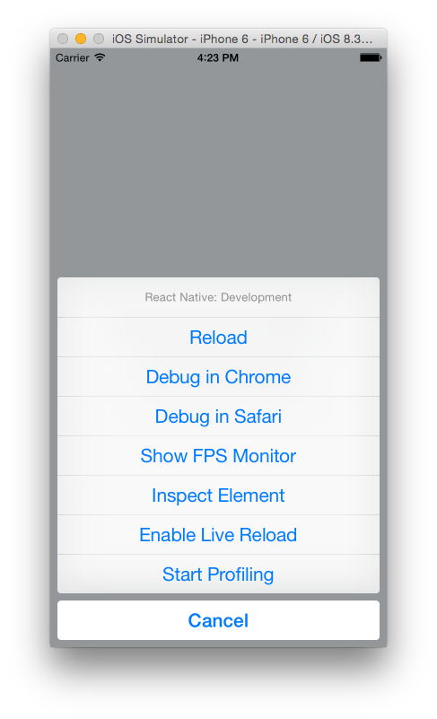

title: React Native
author:
  name: Axel Hernández Ferrera
  twitter: axelhzf
  url: http://axelhzf.com
output: index.html
controls: false
theme: ./theme
--

# React Native

## A step towards the JavaScript World Domination

[@axelhzf](http://twitter.com/axelhzf)

--


--

# why so much hype with React?

--

## React features

* Declarative interfaces
* Performance
* Real projects
* Isomorphic
 
--

## As Angular.js developer


--

## React’s diff algorithm

[http://calendar.perfplanet.com/2013/diff/](http://calendar.perfplanet.com/2013/diff/)

--

# React Canvas

React Canvas adds the ability for React components to render to &lt;canvas\> rather than DOM.

--

## Element width animation


--

## Fluent scroll animations


--


--

# React Native

React Native adds the ability for React components to render to Native Components rather than DOM.

--


```xml
<View>
  <Text style={styles.text} >
    Accesibility Inspector
  </Text>
  <SwitchIOS
      onValueChange={(value) => this.setState({falseSwitchIsOn: value})}
      style={{marginBottom: 10}}
      value={this.state.falseSwitchIsOn} />
</View>
```

--


--

## Why this is so important?

--

## Native development sucks

* iOS and Android
* Developer Velocity
* Reuse libraries
* Manual View Layout

--

## React Native

* Declarative views
* Native Scripting
* npm modules
* CSS subset
* Platform components
* Incremental adoption

--

## How React Native works?

* Javascript is executed in background
* Javascript <-> iOS communication is batched

--


--

# Getting started

--

## Installation

```
npm install -g react-native-cli
react-native init Demo
```

--

## Run the project

```
open Demo/Demo.xcodeproj
```
---

## Development Tools



--

## Hello World

```javascript
var HelloWorld = React.createClass({

  render: function() {
    return (
      <View style={styles.container}>
        <Text style={styles.welcome}>
          Hello world
        </Text>
      </View>
    );
  }
});
```

--

## Hello World 2

* `React.createClass` - Create a component class, given a specification.  
* `render` - A component implements a render method which returns one single child
* `<View>`, `<Text>` - Components

-- 

## JSX

* JSX is a JavaScript syntax extension that looks similar to XML.
* You don't have to use JSX with React.
* Everybody uses JSX

--

## JSX Transformation

```javascript
var Nav, Profile;

// Input (JSX):
var app = (
  <Nav color="blue">
     <Profile>
        click
     </Profile>
  </Nav>);

// Output (JS):
var app = React.createElement(
  Nav,
  {color:"blue"},
  React.createElement(Profile, null, "click")
);

```

--

## Style

* React Native doesn't implement CSS but instead relies on JavaScript to let you style your application. [Why?](https://speakerdeck.com/vjeux/react-css-in-js)
* CSS Subset + Some Native properties ([View](https://facebook.github.io/react-native/docs/view.html#style), [Image](https://facebook.github.io/react-native/docs/image.html#style), [Text](https://facebook.github.io/react-native/docs/text.html#style), [Flex](Flex Properties), [Transform](https://facebook.github.io/react-native/docs/transforms.html#content) )
* Layout using FlexBox

--

## Hello World Style

```javascript
var styles = StyleSheet.create({
  container: {
    flex: 1,
    justifyContent: 'center',
    alignItems: 'center',
    backgroundColor: '#F5FCFF'
  },
  welcome: {
    fontSize: 60,
    textAlign: 'center',
    margin: 10
  }
});
```

--

## Layout using Flexbox

[http://flexboxin5.com/](http://flexboxin5.com/)
[https://scotch.io/tutorials/a-visual-guide-to-css3-flexbox-properties](https://scotch.io/tutorials/a-visual-guide-to-css3-flexbox-properties)

--

## Layout

```javascript
var React = require('react-native');
var { StyleSheet, Text, View, Image} = React;

var Layout = React.createClass({

  render: function() {
    return (
      <View style={styles.container}>
        <Image
          style={styles.image}
          source={{uri: 'http://img2.wikia.nocookie.net/__cb20111004203534/adventuretimewithfinnandjake/images/b/b3/Jake.png'}}
          />
        <Text style={styles.welcome}>
          Hello world 2
        </Text>
      </View>
    );
  }
});
```

--

## Layout Style

```javascript
var styles = StyleSheet.create({
  container: {
    flex: 1,
    justifyContent: 'center',
    alignItems: 'center',
    backgroundColor: '#F5FCFF',
    flexDirection: "row"
  },
  welcome: {
    fontSize: 40,
    textAlign: 'center',
    margin: 10,
    flex: 1
  },
  image: {
    width: 135,
    height: 210
  }
});
```

--

## Event Handler


--

## Event Handler

```javascript
var EventHandler = React.createClass({

  getInitialState() {
    return {active: false}
  },

  onChangeSwitch(value) {
    this.setState({active: value})
  },

  render: function() {
    var label = this.state.active ? "Active" : "Inactive";

    return (
      <View style={styles.container}>
        <Text style={styles.text}>{label}</Text>
        <SwitchIOS
          onValueChange={this.onChangeSwitch}
          style={styles.switch}
          value={this.state.active} />
      </View>
    );
  }

});
```

--

## ListView

```javascript
var ListViewSimpleExample = React.createClass({

  getInitialState: function () {
    var ds = new ListView.DataSource({rowHasChanged: (r1, r2) => r1 !== r2});
    return {
      dataSource: ds.cloneWithRows(TV_SHOWS)
    };
  },

  render: function () {
    return (
      <ListView
        dataSource={this.state.dataSource}
        renderRow={this._renderRow}
        />
    );
  },

  _renderRow: function (rowData, sectionID, rowID) {
    return (
      <View>
        <View style={styles.row}>
          <Image style={styles.thumb} source={{uri: rowData.image}}/>
          <Text style={styles.text}>
            { rowData.name}
          </Text>
        </View>
        <View style={styles.separator}/>
      </View>
    );
  }

});
```

---

## Animations

```javascript
  componentWillMount() {
    LayoutAnimation.spring();
  },

  getInitialState() {
    return { w: 100, h: 100 }
  },

  _onPress() {
    LayoutAnimation.spring();
    if (this.state.w >= 145) {
      this.setState({w: 100, h: 100})
    } else {
      this.setState({w: this.state.w + 15, h: this.state.h + 15})
    }
  },
```

--

## Components list

http://react.parts/native-ios

--

## Dynamic crazy native mobile future powered by javascript

https://medium.com/@clayallsopp/a-dynamic-crazy-native-mobile-future-powered-by-javascript-70f2d56b1987

--

<blockquote class="twitter-tweet" lang="en"><p><a href="https://twitter.com/RReverser">@RReverser</a> Because of a tiny but important clarification. <a href="http://t.co/upC4B3c1Nx">pic.twitter.com/upC4B3c1Nx</a></p>&mdash; Sebastian Markbåge (@sebmarkbage) <a href="https://twitter.com/sebmarkbage/status/575059848083058688">March 9, 2015</a></blockquote>


--

<blockquote class="twitter-tweet" lang="en"><p>React Native is interesting from an app review perspective, since it basically allows to change/update your whole app remotely.</p>&mdash; Peter Steinberger (@steipete) <a href="https://twitter.com/steipete/status/581150907502628864">March 26, 2015</a></blockquote>

--

# Conclusion

--

# It's time to learn React

<blockquote class="twitter-tweet" lang="en"><p>what i&#39;m most impressed about react is that i basically learned it in one day and am not frustrated at all. suck it, angular.</p>&mdash; Jongleberry (@jongleberry) <a href="https://twitter.com/jongleberry/status/588590842748637184">April 16, 2015</a></blockquote>


<script async src="http://platform.twitter.com/widgets.js" charset="utf-8"></script>

<script type="text/javascript">
    var _gaq = _gaq || [];
    _gaq.push(['_setAccount', 'UA-31904298-1']);
    _gaq.push(['_trackPageview']);

    (function() {
        var ga = document.createElement('script'); ga.type = 'text/javascript'; ga.async = true;
        ga.src = ('https:' == document.location.protocol ? 'https://ssl' : 'http://www') + '.google-analytics.com/ga.js';
        var s = document.getElementsByTagName('script')[0]; s.parentNode.insertBefore(ga, s);
    })();
</script>