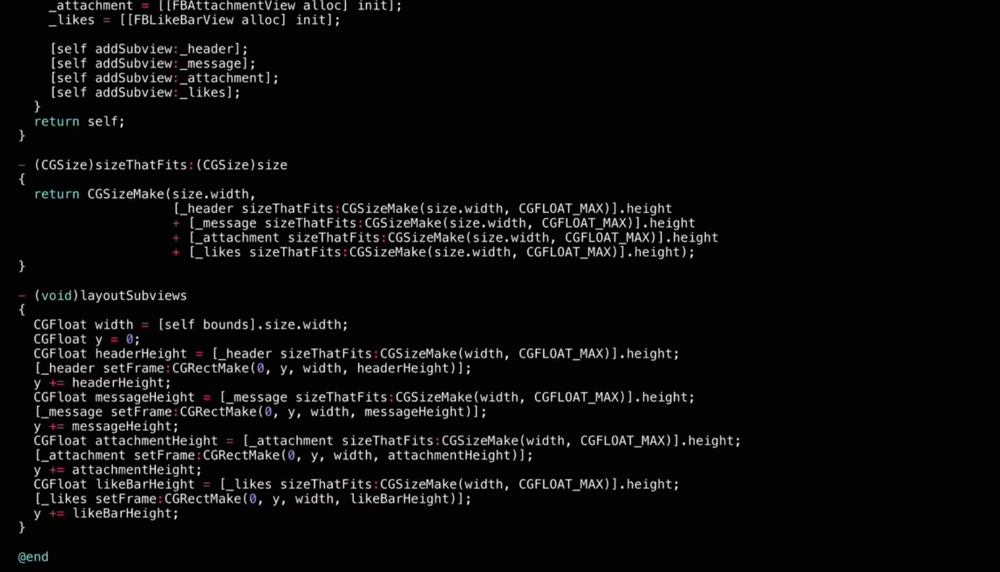

title: React Native
author:
  name: Axel Hernández Ferrera
  twitter: axelhzf
  url: http://axelhzf.com
output: index.html
controls: false
theme: ./theme
--

# React Native

## A step towards the JavaScript World Domination

[@axelhzf](http://twitter.com/axelhzf)

--

# why so much hype with React?

--

## React features

* Declarative interfaces
* Performance
* Real projects
* Isomorphic
 
--

## As Angular.js developer

--

## Stalking React

--

# React Canvas

React Canvas adds the ability for React components to render to &lt;canvas\> rather than DOM.

--

## Element width animation 

--

## Fluent scroll animations

--

--

# React Native

React Canvas adds the ability for React components to render to Native Components rather than DOM.

--

--

## Open source
 
<blockquote class="twitter-tweet" lang="en">
i think <a href="https://twitter.com/github">@github</a>&#39;s &quot;sophisticated ddos attack&quot; is just a bunch of people trying out <a href="https://twitter.com/reactjs">@reactjs</a> native
&mdash; Pete Hunt (@floydophone) <a href="https://twitter.com/floydophone/status/581343475284611072">March 27, 2015</a></blockquote>

--

## Why this is so important?

--

## Native development sucks

* iOS and Android
* Developer Velocity
* Reuse libraries
* Manual View Layout

--

## Manual View Layout

--

## React Native

* Declarative views
* Native Scripting
* npm modules
* CSS subset
* Platform components

--
 
## How React Native works?

* Javascript is executed in background
* Javascript <-> iOS communication is batched

--

--

# Demo time

--

## Components list

http://react.parts/native-ios

--

## Who is using react?

--

## Dynamic crazy native mobile future powered by javascript

https://medium.com/@clayallsopp/a-dynamic-crazy-native-mobile-future-powered-by-javascript-70f2d56b1987

--

# Conclusion

--

# It's time to learn React

<blockquote class="twitter-tweet" lang="en">
what i&#39;m most impressed about react is that i basically learned it in one day and am not frustrated at all. suck it, angular.
&mdash; Jongleberry (@jongleberry) <a href="https://twitter.com/jongleberry/status/588590842748637184">April 16, 2015</a></blockquote>

