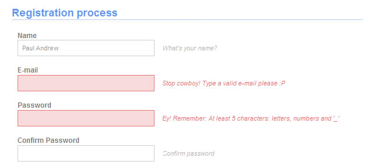
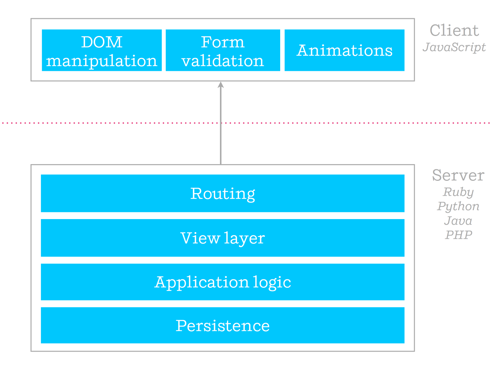
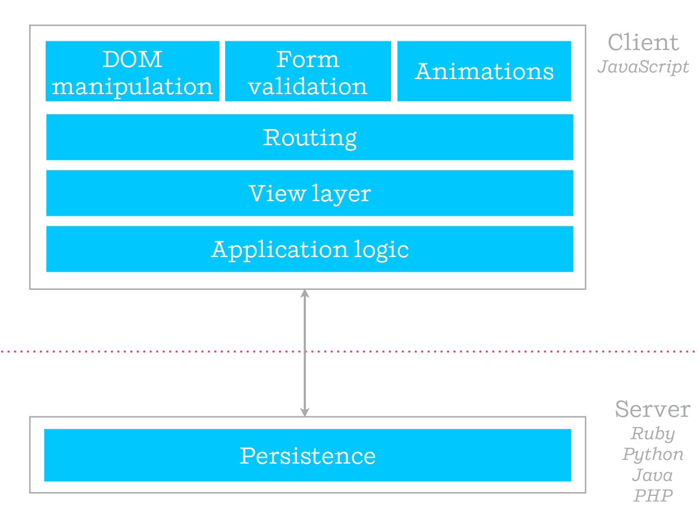
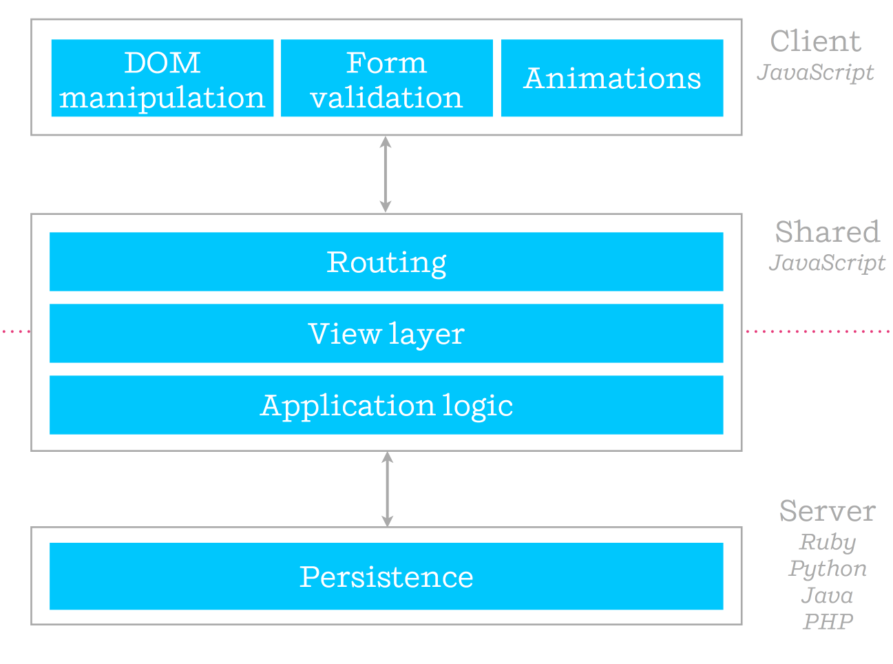

title: Isomorphic js
author:
  name: Axel Hernández Ferrera
  twitter: axelhzf
  url: http://axelhzf.com
output: index.html
controls: false
theme: ./theme
--

# Isomorphic JS

## Sharing code between server and browser

[@axelhzf](http://twitter.com/axelhzf)

--


# WTF is Isomorphic JS

--

### Definition

iso·mor·phic (adj.)

1. being of identical or similar form, shape, or structure
2. related by an isomorphism

--

### Isomorphic JS

By isomorphic we mean that any given line of code (with notable exceptions) can execute both on the client and the server.

[Defining Isomorphic Javascript](https://the-pastry-box-project.net/charlie-robbins/2014-november-5)

--


--

### Why?



--

### Client-side form validation (JavaScript)

```javascript
function validate(email, password) {
	return validateEmail(email) && validatePassword(password);
}

function validateEmail(email) { 
    var re = /^(([^<>()[\]\\.,;:\s@\"]+(\.[^<>()[\]\\.,;:\s@\"]+)*)|(\".+\"))@((\[[0-9]{1,3}\.[0-9]{1,3}\.[0-9]{1,3}\.[0-9]{1,3}\])|(([a-zA-Z\-0-9]+\.)+[a-zA-Z]{2,}))$/;
    return re.test(email);
} 

function validatePassword(password) {
	return password.length > 5;
}
```

--

### Server-side form validation (Java)


```java
public boolean validate (String email, String password) {
	return validateEmail(email) && validatePassword(password);
}

private boolean validateEmail(String email) {
	String ePattern = "^[a-zA-Z0-9.!#$%&'*+/=?^_`{|}~-]+@((\\[[0-9]{1,3}\\.[0-9]{1,3}\\.[0-9]{1,3}\\.[0-9]{1,3}\\])|(([a-zA-Z\\-0-9]+\\.)+[a-zA-Z]{2,}))$";
	java.util.regex.Pattern p = java.util.regex.Pattern.compile(ePattern);
	java.util.regex.Matcher m = p.matcher(email);
	return m.matches();
}

private boolean function validatePassword(String password) {
	return password.length() > 5;
}
```
--

> “Duplication may be the root of all evil in software.” 
  ― Robert C. Martin, Clean Code

--

### Option A: Use a language that compile to JavaScript

https://github.com/jashkenas/coffeescript/wiki/list-of-languages-that-compile-to-js

379

--

### Option B: Server-side JavaScript


--

### validate.js

```javascript
function validate(email, password) {
	return validateEmail(email) && validatePassword(password);
}

function validateEmail(email) { 
    var re = /^(([^<>()[\]\\.,;:\s@\"]+(\.[^<>()[\]\\.,;:\s@\"]+)*)|(\".+\"))@((\[[0-9]{1,3}\.[0-9]{1,3}\.[0-9]{1,3}\.[0-9]{1,3}\])|(([a-zA-Z\-0-9]+\.)+[a-zA-Z]{2,}))$/;
    return re.test(email);
} 

function validatePassword(password) {
	return password.length > 5;
}
```

--

### validate.js commonjs

```javascript
module.exports = function validate(email, password) {
	return validateEmail(email) && validatePassword(password);
}

function validateEmail(email) { 
    var re = /^(([^<>()[\]\\.,;:\s@\"]+(\.[^<>()[\]\\.,;:\s@\"]+)*)|(\".+\"))@((\[[0-9]{1,3}\.[0-9]{1,3}\.[0-9]{1,3}\.[0-9]{1,3}\])|(([a-zA-Z\-0-9]+\.)+[a-zA-Z]{2,}))$/;
    return re.test(email);
} 

function validatePassword(password) {
	return password.length > 5;
}
```
--

### app.js

```javascript
var validate = require("./validate");

app.post('/form', function (req, res) {
  validate(req.body.email, req.body.password);

  ...

});
```
--

### Browser 

```
<script src="validate.js">
```

```javascript
Uncaught ReferenceError: module is not defined
```

--


# 

--

### Browserify 

Browserify lets you require('modules') in the browser by bundling up all of your dependencies.

```
npm install -g browserify
browserify main.js -o bundle.js
```

```
<script src="bundle.js"></script>
```

--

### Using third party libraries

```
npm install validator
```

```javascript
var validator = require("validator");

function validate(email, password) {
	return validator.isEmail(email) && validator.isLength(password, 5, 15);
}
```

```
browserify main.js -o bundle.js
```

--

### Browserify shim

```javascript
{
  "name": "mypkg",
  "version": "1.2.3",
  "main": "main.js",
  "browser": {
    "lib/foo.js": "lib/browser-foo.js"
  }
}
```

--

### Learn more about browserify

https://github.com/substack/browserify-handbook

-- 

### Sharing code in a web application

* Model validation
* Date & currency formatting
* I18N
* API interaction
* Routing
* Templating

--

### Evolution of web applications



--

### Evolution of web applications



--

### Future of web applications?



--

### Benefits

* Share code between server and client
* Faster first load
* SEO

--

### Share templating: Handlebars


```
<div class="entry">
  <h1>{{title}}</h1>
  <h2>By {{author.name}}</h2>

  <div class="body">
    {{body}}
  </div>
</div>
```


--

### Angular?

http://berzniz.com/post/99158163051/isomorphic-javascript-angular-js-is-not-the


--

### Ember ?

Fastboot WIP: http://emberjs.com/blog/2014/12/22/inside-fastboot-the-road-to-server-side-rendering.html


--

### React


--

### React : browser

```javascript
var HelloMessage = React.createClass({
  render: function() {
    return <div>Hello {this.props.name}</div>;
  }
});

React.render(<HelloMessage name="John" />, document.body);
```

--

### React : server

```javascript
React.renderToString(<HelloMessage name="John" />);
```

```
<div data-reactid=".1" data-react-checksum="425337345">
	<span data-reactid=".1.0">Hello </span>
	<span data-reactid=".1.1">John</span>
</div>
```

--

# Isomorphic persistence?

--

# 

--

## Meteor features

* Isomorphic
* Database Everywhere
* Realtime
* Data on the Wire

--


--

# Demo time

